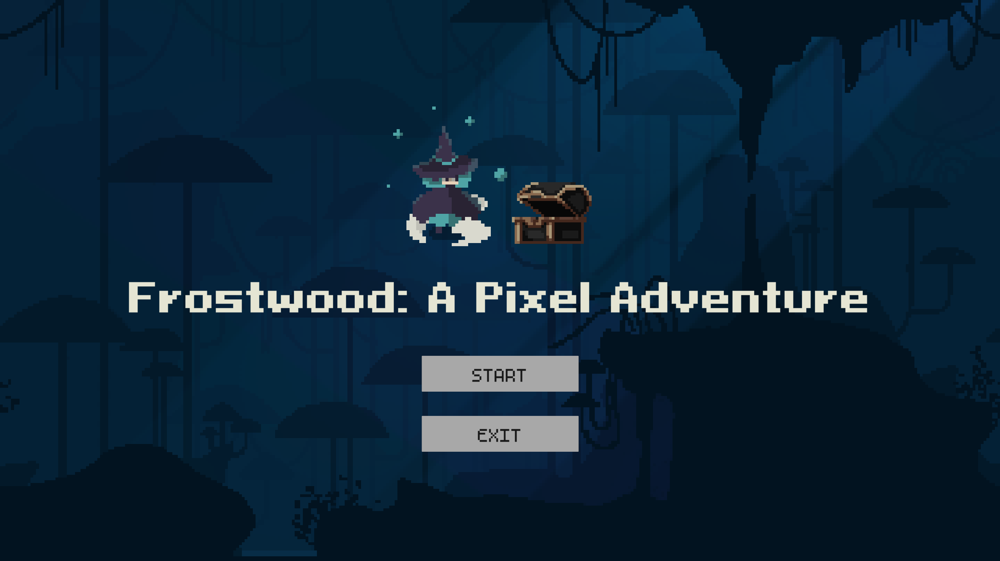

# ❄️ Frostwood: A Pixel Adventure

**Frostwood** is an enchanting 2D platformer game built from scratch with Unity. Immerse yourself in a frosty forest adventure as you guide your character through challenging levels filled with mysteries, enemies, and hidden secrets.

---

## ✨ Features

- 🎨 **Original Art and Animation**: Enjoy a captivating, frosty environment crafted with pixel art, along with smooth animations built frame-by-frame. Including visual assets were created by hand to bring a unique style to the game.
- 🎮 **Engaging Gameplay**: Experience challenging platforming mechanics, with intricate puzzles and dynamic enemies designed to keep players engaged.
- 🕹️ **Character Abilities**: Execute a range of actions, including basic movements, attacks, and environmental interactions, all brought to life through custom animations and detailed animator configurations.
- 🛠️ **Comprehensive Scripting**: All gameplay elements, from damage mechanics and collectible items to enemy behaviors and camera control are powered by custom-written scripts.

---

## 🎮 Controls

| **Action**    | **Key/Button**      |
|---------------|---------------------|
| Move          | Arrow Keys or `W/A/D`|
| Jump          | Up Arrow or `W`     |
| Attack        | Space bar or `E`    |
| Quit          | `Esc`               |

---

## 🛠️ Installation

1. **Download the Game**:
   - Go to the [Releases](https://github.com/annied11/Frostwood/releases) section of this repository.
   - Download the latest version of the game ZIP file (e.g., `download.zip`).

2. **Extract the ZIP File**:
   - Once downloaded, extract the contents of the ZIP file to a folder on your computer.

3. **Run the Game**:
   - Open the extracted folder.
   - Run the main application file named `mushroom2` to start playing.
   
> **Note**: Make sure to keep all files in the same folder as the main application file, as they are required for the game to run properly.

---

## 🕹️ How to Play

- 🏃 **Navigate**: Guide your character through a challenging environment, skillfully avoiding obstacles and confronting enemies.
- 💎 **Collectables**: Collect **all diamonds** within the range to unlock the path forward; Gather **mushrooms** strategically to restore health as needed.
- 🏆 **Win the Game**: Contribute all collected diamonds at the final checkpoint to successfully complete the game.

---

## 🔧 Development Tools

- 🖥️ **Engine**: Unity
- 🧑‍💻 **Programming Language**: C#
- 🎨 **Graphics**: Custom 2D assets
- 🎵 **Audio**: [Audio](https://github.com/annied11/Frostwood/Assets/Audio)

---

## 🤝 Contributing & Contact

Interested in contributing to Frostwood? Feel free to fork this repository and submit a pull request with your improvements or suggestions. We welcome you to provide any questions or feedback to [Annie](mailto:anniedwy03@gmail.com) :)

---

## 📜 License

This project is licensed under the [MIT License](LICENSE).
